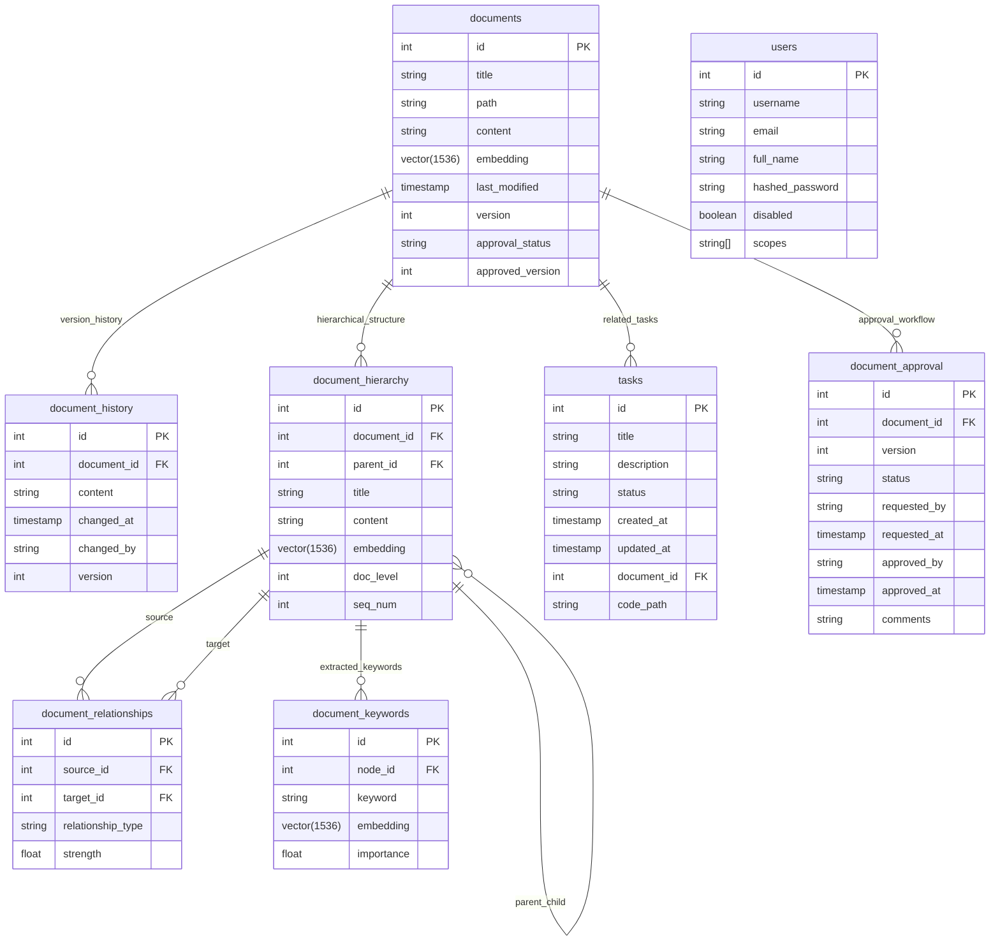

# DokuCORE Database Schema Documentation

## Overview

This document provides a comprehensive description of the DokuCORE database schema, including table structures, relationships, indices, and the rationale behind design decisions. DokuCORE uses PostgreSQL with the pgvector extension to enable vector similarity search for efficient document retrieval.

## Schema Diagram

## Tables

### documents

The core table that stores metadata and content for all documents in the system.

| Column            | Type              | Description                                             | Constraints                |
|-------------------|-------------------|---------------------------------------------------------|----------------------------|
| id                | INTEGER           | Document identifier                                     | PRIMARY KEY                |
| title             | TEXT              | Document title                                          | NOT NULL                   |
| path              | TEXT              | Logical path in the documentation hierarchy             | NOT NULL                   |
| content           | TEXT              | Full document content (markdown)                        | NOT NULL                   |
| embedding         | VECTOR(1536)      | Vector embedding of the document content               |                            |
| last_modified     | TIMESTAMP         | Last modification time                                  | DEFAULT CURRENT_TIMESTAMP  |
| version           | INTEGER           | Current document version                                | DEFAULT 1                  |
| approval_status   | STRING(20)        | Approval status (draft, pending, approved, rejected)    | DEFAULT 'draft', NOT NULL  |
| approved_version  | INTEGER           | Latest approved version number                          | NULLABLE                   |

**Indexes:**
- Primary key on `id`
- HNSW index on `embedding` using vector_cosine_ops with optimized parameters (m=16, ef_construction=128, ef=100)

**Purpose:** This table serves as the entry point for all document operations, storing the current version of each document along with its metadata. The vector embedding enables semantic search across documents.

### document_history

Tracks the version history of all documents.

| Column      | Type              | Description                                  | Constraints               |
|-------------|-------------------|----------------------------------------------|---------------------------|
| id          | INTEGER           | History entry identifier                     | PRIMARY KEY               |
| document_id | INTEGER           | Reference to the document                    | FOREIGN KEY documents(id) |
| content     | TEXT              | Historical document content                  | NOT NULL                  |
| changed_at  | TIMESTAMP         | When the change was made                     | DEFAULT CURRENT_TIMESTAMP |
| changed_by  | TEXT              | User who made the change                     |                           |
| version     | INTEGER           | Version number of this historical entry      | NOT NULL                  |

**Indexes:**
- Primary key on `id`
- Foreign key on `document_id` (documents.id)

**Purpose:** This table enables full version control of documents, allowing users to view previous versions, track changes, and restore to previous versions if needed.

### document_hierarchy

Stores the hierarchical structure of documents, breaking them down into sections based on Markdown headers.

| Column      | Type              | Description                                  | Constraints                       |
|-------------|-------------------|----------------------------------------------|-----------------------------------|
| id          | INTEGER           | Node identifier                              | PRIMARY KEY                       |
| document_id | INTEGER           | Reference to the document                    | FOREIGN KEY documents(id)         |
| parent_id   | INTEGER           | Reference to parent node                     | FOREIGN KEY document_hierarchy(id)|
| title       | TEXT              | Section title (from Markdown header)         | NOT NULL                          |
| content     | TEXT              | Section content                              | NOT NULL                          |
| embedding   | VECTOR(1536)      | Vector embedding of the section              |                                   |
| doc_level   | INTEGER           | Header level (h1, h2, h3, etc.)              | NOT NULL                          |
| seq_num     | INTEGER           | Sequence number for ordering                 | NOT NULL                          |

**Indexes:**
- Primary key on `id`
- Foreign key on `document_id` (documents.id)
- Foreign key on `parent_id` (document_hierarchy.id)
- HNSW index on `embedding` using vector_cosine_ops with optimized parameters (m=16, ef_construction=128, ef=100)

**Purpose:** This table is central to DokuCORE's hierarchical indexing system. By breaking documents into sections based on their hierarchical structure, it enables:
1. More granular and relevant search results
2. Efficient token usage (only loading relevant sections)
3. Contextual understanding of document structure
4. Tracking of relationships between document sections

### document_relationships

Stores relationships between document sections, enabling navigation through semantically related content.

| Column           | Type              | Description                                      | Constraints                         |
|------------------|-------------------|--------------------------------------------------|-------------------------------------|
| id               | INTEGER           | Relationship identifier                          | PRIMARY KEY                         |
| source_id        | INTEGER           | Source node in the relationship                  | FOREIGN KEY document_hierarchy(id)  |
| target_id        | INTEGER           | Target node in the relationship                  | FOREIGN KEY document_hierarchy(id)  |
| relationship_type| TEXT              | Type of relationship (sibling, semantic, etc.)   | NOT NULL                            |
| strength         | FLOAT             | Relationship strength (0.0-1.0)                  | NOT NULL                            |

**Indexes:**
- Primary key on `id`
- Foreign key on `source_id` (document_hierarchy.id)
- Foreign key on `target_id` (document_hierarchy.id)

**Purpose:** This table captures the semantic and structural relationships between different sections of the documentation. These relationships are used during search to provide contextually relevant results beyond simple keyword matching.

### document_keywords

Stores keywords extracted from document sections with their importance scores and embeddings.

| Column     | Type              | Description                                 | Constraints                        |
|------------|-------------------|---------------------------------------------|-----------------------------------|
| id         | INTEGER           | Keyword entry identifier                    | PRIMARY KEY                        |
| node_id    | INTEGER           | Reference to document hierarchy node        | FOREIGN KEY document_hierarchy(id) |
| keyword    | TEXT              | Extracted keyword                           | NOT NULL                           |
| embedding  | VECTOR(1536)      | Vector embedding of the keyword             |                                    |
| importance | FLOAT             | Keyword importance score (0.0-1.0)          | NOT NULL                           |

**Indexes:**
- Primary key on `id`
- Foreign key on `node_id` (document_hierarchy.id)
- HNSW index on `embedding` using vector_cosine_ops with optimized parameters (m=16, ef_construction=128, ef=100)

**Purpose:** This table enhances search capabilities by:
1. Enabling direct keyword-based search alongside semantic search
2. Providing relevance scoring based on keyword importance
3. Creating additional connections between related sections through shared keywords

### tasks

Stores documentation tasks, which can be generated automatically or created manually.

| Column      | Type              | Description                               | Constraints                |
|-------------|-------------------|-------------------------------------------|----------------------------|
| id          | INTEGER           | Task identifier                           | PRIMARY KEY                |
| title       | TEXT              | Task title                                | NOT NULL                   |
| description | TEXT              | Task description                          | NOT NULL                   |
| status      | TEXT              | Task status (pending, in-progress, etc.)  | DEFAULT 'pending'          |
| created_at  | TIMESTAMP         | Creation time                             | DEFAULT CURRENT_TIMESTAMP  |
| updated_at  | TIMESTAMP         | Last update time                          | DEFAULT CURRENT_TIMESTAMP  |
| document_id | INTEGER           | Related document (if any)                 | FOREIGN KEY documents(id)  |
| code_path   | TEXT              | Related code path (if any)                |                            |

**Indexes:**
- Primary key on `id`
- Foreign key on `document_id` (documents.id)

**Purpose:** This table manages documentation maintenance tasks, enabling:
1. Tracking of documentation work that needs to be done
2. Integration with the code monitoring system to auto-generate tasks based on code changes
3. Assignment and status tracking of documentation work

### users

Stores user information for authentication and authorization.

| Column          | Type              | Description                              | Constraints                                         |
|-----------------|-------------------|------------------------------------------|-----------------------------------------------------|
| id              | INTEGER           | User identifier                          | PRIMARY KEY                                         |
| username        | TEXT              | Username                                 | NOT NULL, UNIQUE                                    |
| email           | TEXT              | Email address                            | NOT NULL, UNIQUE                                    |
| full_name       | TEXT              | User's full name                         |                                                     |
| hashed_password | TEXT              | Securely hashed password                 | NOT NULL                                            |
| disabled        | BOOLEAN           | Account status                           | DEFAULT false                                       |
| scopes          | TEXT[]            | Authorization scopes                     | DEFAULT '{"documents:read", "tasks:read"}'          |

**Indexes:**
- Primary key on `id`
- Unique index on `username`
- Unique index on `email`

**Purpose:** This table supports the authentication and authorization system, enabling:
1. User authentication via username and password
2. Role-based access control through scopes
3. User profile management

### document_approval

Manages the document approval workflow.

| Column       | Type              | Description                             | Constraints                |
|--------------|-------------------|-----------------------------------------|----------------------------|
| id           | INTEGER           | Approval entry identifier               | PRIMARY KEY                |
| document_id  | INTEGER           | Related document                        | FOREIGN KEY documents(id)  |
| version      | INTEGER           | Version to approve                      | NOT NULL                   |
| status       | STRING(20)        | Status (pending, approved, rejected)    | DEFAULT 'pending', NOT NULL|
| requested_by | STRING(100)       | User requesting approval                | NOT NULL                   |
| requested_at | TIMESTAMP         | Request time                            | DEFAULT CURRENT_TIMESTAMP  |
| approved_by  | STRING(100)       | User who approved/rejected              |                            |
| approved_at  | TIMESTAMP         | Approval/rejection time                 |                            |
| comments     | TEXT              | Additional comments                     |                            |

**Indexes:**
- Primary key on `id`
- Foreign key on `document_id` (documents.id)
- Index on `document_id, version`

**Purpose:** This table implements the document approval workflow, allowing:
1. Formal review and approval of document changes
2. Tracking of approval status
3. Commenting on document versions

## Indices and Performance Optimization

### Vector Indices (HNSW)

DokuCORE uses the Hierarchical Navigable Small World (HNSW) algorithm to create efficient indices for vector similarity search. These indices are used on all vector embedding columns:

- documents.embedding
- document_hierarchy.embedding
- document_keywords.embedding

The HNSW indices are configured with the following optimized parameters:

- **m = 16**: Maximum number of connections per node (higher values increase accuracy but slow down index construction)
- **ef_construction = 128**: Size of the dynamic candidate list during index construction (higher values increase accuracy but slow down index construction)
- **ef = 100**: Size of the dynamic candidate list during search (higher values increase accuracy but slow down search)

These parameters are optimized to balance search accuracy, build time, and query performance for the document search use case.

### Foreign Key Indices

All foreign key relationships have associated indices to optimize query performance, particularly for join operations.

### Custom Indices

- Composite index on `document_approval(document_id, version)` to efficiently look up approval requests for specific document versions

## Relationships

### Parent-Child Relationships

- **documents → document_history**: One-to-many relationship tracking the version history of each document
- **documents → document_hierarchy**: One-to-many relationship breaking down documents into hierarchical sections
- **documents → tasks**: One-to-many relationship connecting documents to related tasks
- **documents → document_approval**: One-to-many relationship for the document approval workflow
- **document_hierarchy → document_hierarchy**: Self-referential parent-child relationship for the document section hierarchy
- **document_hierarchy → document_keywords**: One-to-many relationship for keywords extracted from each section

### Many-to-Many Relationships

- **document_hierarchy ↔ document_hierarchy**: Many-to-many relationship for document section relationships, implemented through the document_relationships table

## Vector Embeddings

DokuCORE uses a vector dimension of 1536 for all embeddings, compatible with various embedding models including OpenAI's models and open-source alternatives like SentenceTransformers. The embeddings are stored in the following columns:

- documents.embedding: Vector representation of the entire document
- document_hierarchy.embedding: Vector representation of each document section
- document_keywords.embedding: Vector representation of each extracted keyword

These embeddings enable efficient semantic search by comparing the similarity between query vectors and document vectors using cosine similarity.

## Migration History

DokuCORE's database schema has evolved through the following migrations:

1. **001_initial_schema.py**: Initial schema with documents, document_history, tasks, document_hierarchy, document_relationships, and document_keywords tables
2. **002_add_users_table.py**: Added users table for authentication and authorization
3. **003_optimize_pgvector_indices.py**: Optimized vector indices with HNSW algorithm parameters
4. **004_add_document_approval.py**: Added document approval workflow

## Design Decisions

### Hierarchical Document Structure

The design decision to break documents into hierarchical sections (document_hierarchy) was made to:

1. **Improve Search Relevance**: By searching at the section level, results can be more precise and focused
2. **Reduce Token Usage**: When working with LLMs, loading only relevant sections saves 70-95% on token usage
3. **Preserve Context**: The hierarchical structure maintains the relationships between sections
4. **Enable Semantic Relationships**: Sections can be related based on their content, not just structural position

### Vector Search with pgvector

The use of pgvector for vector similarity search provides several advantages:

1. **Semantic Understanding**: Vector embeddings capture the semantic meaning of text
2. **Efficient Similarity Search**: HNSW indices enable fast approximate nearest neighbor search
3. **Integration with PostgreSQL**: Keeping vector search in the database simplifies architecture
4. **Hybrid Search Capabilities**: Combining traditional keyword search with vector similarity

### Document Versioning and Approval

The comprehensive versioning and approval system enables:

1. **Complete Change History**: Every document change is tracked
2. **Rollback Capability**: Documents can be restored to previous versions
3. **Formal Review Process**: Changes can be reviewed and approved
4. **Governance and Compliance**: Documentation changes can follow appropriate approval workflows

## Conclusion

DokuCORE's database schema is designed to support AI-powered documentation management with hierarchical indexing, semantic search, version control, and approval workflows. The schema balances performance, flexibility, and functionality, providing a solid foundation for the system's advanced features.

The use of PostgreSQL with pgvector enables sophisticated vector similarity search while maintaining the advantages of a robust relational database system. The carefully designed relationships between tables support efficient querying and navigation of the document structure.
